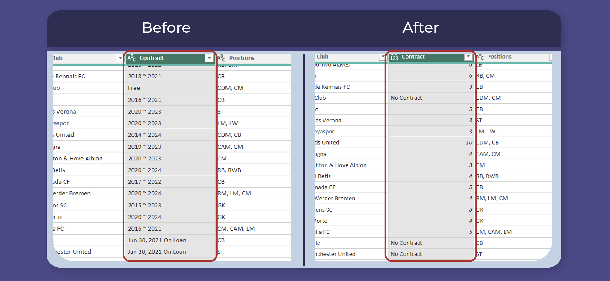

# **FIFA 21 DATA CLEANING**

## Introduction
This documentation outlines the data cleaning process for the **FIFA 21 dataset**, which was obtained from [Kaggle.](https://www.kaggle.com/datasets/yagunnersya/fifa-21-messy-raw-dataset-for-cleaning-exploring) The raw data file was named "fifa21 raw data v2.csv" and was provided as part of a **Data Cleaning Challenge** for data analysts of all levels. The data cleaning process was completed using Power Query, a powerful data transformation tool. The purpose of this project was to clean and prepare the dataset for further analysis.

## Data Description
The FIFA 21 dataset contains 18,979 rows and 77 columns. The dataset includes a variety of data types, including whole numbers, text, and dates. The columns contain a range of information related to FIFA player statistics, such as player name, club, nationality, position, earnings, performance metrics and so on.

## Data Cleaning Process
Using M language and a host of tools available in Power Query Editor, I was able to perform the following transformations to the data set;

### - String/Text Cleaning:
One of the issues identified during the data cleaning process was with the "Club" column. The column contained some dirty data that needed to be cleaned. To clean the data in this column, the Power Query function Text.Clean was used. By applying this transformation, any extraneous whitespace, line breaks, or other non-printable characters were removed from the "Club" column, resulting in a cleaner, more consistent dataset. _[see preview below;]_

Another issue that was identified during the data cleaning process was with the "Contract" column. The column contained contract start and end dates that were separated by a tilde (~) character. To fix this issue, an M code transformation was applied to the dataset.
This code uses the if-then-else statement to identify the delimiter (~), then subtracts the value before delimeter from the value after delimiter. It also returns "No Contract" for records showing "Free" or "Loan" indicating that such players does not have an active contract.

By applying this transformation, the "Contract" column was cleaned and standardized to contain only contract duration information, making it easier to analyze and work with the data.

